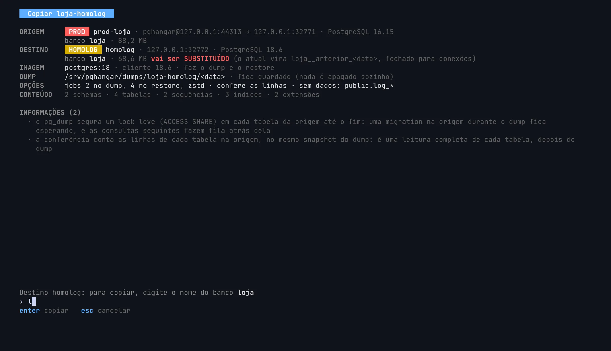
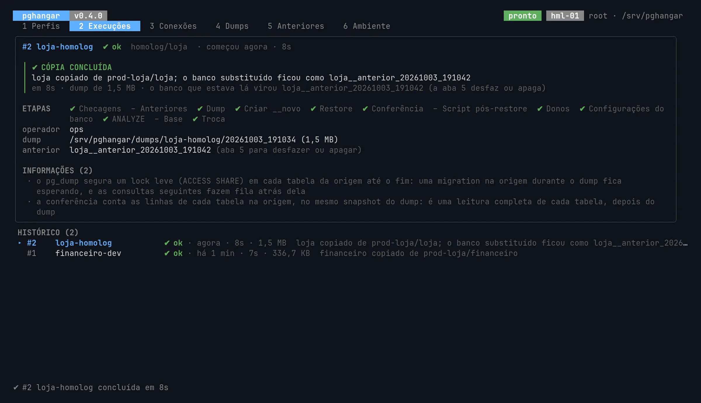

<p align="center">
  
</p>

<h1 align="center">pghangar</h1>

<p align="center"><strong>A produção no homolog, com um enter e com desfazer.</strong></p>

<p align="center"><a href="https://pghangar.dev">pghangar.dev</a> · da família 9Level: <a href="https://pgrunway.dev">pgrunway</a>, <a href="https://pgtower.dev">pgtower</a> e pghangar</p>

[](https://github.com/9LEVEL/pghangar/actions/workflows/ci.yml)
[](https://github.com/9LEVEL/pghangar/releases/latest)
[](LICENSE)

Uma ferramenta de sysadmin, com TUI, que copia um banco PostgreSQL de um servidor para outro por dump e
restore. O caso típico é puxar um banco da produção para um banco de desenvolvimento ou homologação que
já existe. As conexões e os perfis ficam salvos, e repetir uma cópia é escolher o perfil e confirmar.

O nome: o hangar é onde o avião fica guardado e é preparado para voar, ao lado da torre (o
[pgtower](https://github.com/9LEVEL/pgtower)) e da pista (o [pgrunway](https://pgrunway.dev)).



| | |
|---|---|
| **Onde roda** | no servidor que recebe as cópias (desenvolvimento ou homologação), como root |
| **Versões** | PostgreSQL 16, 17 e 18, na mesma versão ou subindo |
| **Como copia** | `pg_dump` e `pg_restore` oficiais, em containers `postgres:16`, `17` e `18` |
| **Acesso à produção** | por túnel SSH (com bastion, se precisar), aberto pela própria ferramenta, com uma chave restrita ao túnel |
| **O destino** | substituído por troca de nomes. O antigo fica como `__anterior`, com desfazer |
| **O que não faz** | anonimizar dados; apagar qualquer coisa sem perguntar; escrever num banco `prod` |

## As promessas

- **A origem só é lida.** Toda sessão com ela começa com `default_transaction_read_only`.
- **Um banco `prod` nunca é destino.** A regra fica no motor, pela tag, pelo servidor e pelo endereço, e
  nenhuma opção a desliga. Um servidor só vira destino depois de aprovado, uma vez, de propósito.
- **Nada é apagado sem a pergunta.** O banco substituído vira `__anterior`, e a aba 5 o desfaz.
- **Descer de versão é bloqueado:** uma imagem só, a da maior versão, faz o dump e o restore.
- **A senha nunca vai na linha de comando** nem no ambiente de um container: entra por um `pgpass`
  temporário montado.

O porquê de cada uma está em [`docs/DECISOES.md`](docs/DECISOES.md).

## Instalar

Num servidor Linux, com Docker:

```bash
curl -fsSL https://pghangar.dev/install | sudo sh
```

O [`install.sh`](install.sh) baixa o binário da última release, confere o SHA-256 e o instala em
`/opt/pghangar` e `/usr/local/bin`. Para atualizar, o mesmo comando: uma cópia em andamento continua com o
binário que já estava rodando. `PGHANGAR_VERSAO=vX.Y.Z` fixa uma versão.

Num servidor novo, o [pgrunway](https://pgrunway.dev) instala o PostgreSQL, o Docker e o pghangar de
uma vez (`sudo bash install.sh --com-docker`).

Do código (precisa do Go 1.27):

```bash
git clone https://github.com/9LEVEL/pghangar.git && cd pghangar
sudo make instalar            # compila e instala em /opt/pghangar e /usr/local/bin
```

## A primeira vez

```bash
sudo pghangar                 # a tela; os dados ficam em /var/lib/pghangar
sudo pghangar --dir /outro    # outro diretório de dados
```

1. **aba 6:** `b` baixa as imagens `postgres:16`, `17` e `18` e trava pelo digest; `g` gera a chave
   SSH; `l` mostra as linhas prontas para o `authorized_keys` de cada servidor da produção;
2. **aba 3:** `a` cadastra a produção (tag `prod`, acesso `ssh`) e o destino (`homolog` ou `dev`). Ao
   salvar, a conexão é testada em camadas e a versão é lida. **Antes da primeira cópia para um
   servidor, aprove-o como destino** (tecla `v`): sem isso, a cópia é bloqueada;
3. **aba 1:** `a` cria o perfil. Os bancos se escolhem numa lista: digite parte do nome para filtrar, e
   o espaço marca. Marcar vários cria um perfil por banco, já marcados para copiar em fila. Daí em
   diante, copiar é **enter** e confirmar (`y` num destino dev; o nome do banco num homolog).

A cópia roda num processo separado: pode fechar a tela (ou cair o SSH) sem pará-la.



## Sem a tela (cron)

```bash
pghangar rodar loja-dev                        # destino dev
pghangar rodar --confirmar loja loja-homolog   # destino homolog: o nome do banco é obrigatório
```

Sai com 0 (ok), 2 (a troca espera a decisão, pela tela) ou 1 (erro). Não pergunta nada (use senha
guardada ou pgpass, e aceite a chave do servidor SSH pela tela antes) e nunca apaga anteriores. Um
timer do systemd, por exemplo, toda madrugada:

```ini
# /etc/systemd/system/pghangar-loja.service
[Service]
Type=oneshot
ExecStart=/usr/local/bin/pghangar rodar --confirmar loja loja-homolog

# /etc/systemd/system/pghangar-loja.timer
[Timer]
OnCalendar=*-*-* 03:30
[Install]
WantedBy=timers.target
```

## Restaurar um arquivo de fora

Um backup, ou um dump que alguém mandou, vira um banco de dev ou homolog sem `pg_restore` à mão:

```bash
sudo mv loja_20261001.dump /var/lib/pghangar/entrada/
sudo pghangar      # aba 4: r no arquivo, escolha a conexão e o banco, confirme
sudo pghangar restaurar --destino dev --banco loja loja_20261001.dump   # ou sem a tela
```

Aceita os formatos do `pg_dump` (custom, tar e diretório) e SQL puro (`.sql`, `.sql.gz`). O banco que
estava lá vira `__anterior`, com desfazer, e o arquivo continua na pasta. Para subir um arquivo grande,
use o `rsync` (ou copie com um nome que começa com ponto e renomeie no fim): assim ele não aparece na
lista pela metade. Detalhes em [`docs/ESTRATEGIA.md`](docs/ESTRATEGIA.md) §17.

## Testar

```bash
make testar                                                    # gofmt, go vet e os unitários
go test -tags integracao ./internal/motor/ -timeout 30m        # motor: matriz 16/17/18, túnel, troca, desfazer
go test -tags integracao ./internal/execucao/ -timeout 30m     # o binário: processo separado, SIGTERM, kill -9
```

Os de integração sobem containers `postgres:16/17/18` presos em `127.0.0.1` e um servidor SSH de teste
dentro do processo: **nenhum outro host é contatado**. Precisam das imagens baixadas.

## Documentos

| | |
|---|---|
| **[`docs/ESTRATEGIA.md`](docs/ESTRATEGIA.md)** | **o desenho: conexões, versões, imagens, o motor, a troca, as telas, os pacotes e as fases** |
| [`docs/DECISOES.md`](docs/DECISOES.md) | o que foi decidido, e por quê |
| [`docs/MERCADO.md`](docs/MERCADO.md) | o que existe no mercado, onde o pghangar se encaixa e as ideias de lá |
| [`CONTRIBUTING.md`](CONTRIBUTING.md) | como montar o ambiente, os testes e as regras para propor uma mudança |
| [`SECURITY.md`](SECURITY.md) | como relatar uma vulnerabilidade, em particular |
| [`CLAUDE.md`](CLAUDE.md) | regras para agentes que trabalham aqui |

## Licença

O código é [MIT](LICENSE). O nome e o logo do pghangar e da 9Level são marcas: veja o
[`TRADEMARKS.md`](TRADEMARKS.md).
